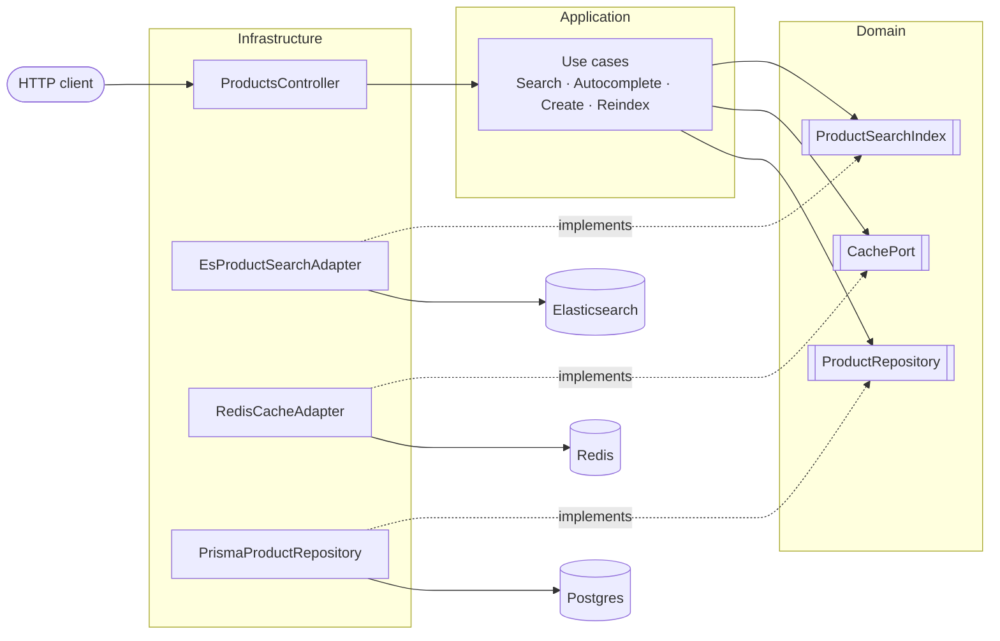

# Advanced Product Search API

A NestJS API for advanced product search built around Elasticsearch relevance, Redis backed autocomplete and a Postgres source of truth. The codebase follows a hexagonal architecture so the domain and application layers stay free of any framework or vendor detail.

## Table of contents

1. [Features](#features)
2. [Architecture](#architecture)
3. [Tech stack](#tech-stack)
4. [Quick start with Docker](#quick-start-with-docker)
5. [Local development](#local-development)
6. [Configuration](#configuration)
7. [API reference](#api-reference)
8. [Testing](#testing)
9. [Design notes](#design-notes)
10. [Known tradeoffs and next steps](#known-tradeoffs-and-next-steps)

## Features

* Full text search over name, description, category, subcategories, location and price.
* Relevance ranking. Name matches weigh highest, with a gentle popularity boost blended into the score.
* Autocomplete served from Elasticsearch and cached in Redis for the highly repetitive keystroke traffic.
* Query suggestions (did you mean) powered by a phrase suggester.
* Combined and individual faceting for categories, subcategories, location and price.
* Filtering by category, subcategories, location and price range.
* Pagination and sorting by relevance, popularity or creation date.
* Typo tolerance through fuzzy matching, so labtop still finds laptops.
* Environment driven configuration validated at startup, global error handling and a dependency aware health check.

## Architecture

The `products` module is split into three layers. Dependencies always point inward, toward the domain.



The use cases depend on the ports (the boxed interfaces). The adapters implement those ports, so the arrows of implementation point inward toward the domain: that is the dependency inversion that keeps the core independent of Elasticsearch, Redis and Prisma. The folder layout mirrors it:

```
src/products/
  domain/                      core, no framework or vendor imports
    product.ts                 Product aggregate
    ports/                     ProductRepository, ProductSearchIndex, CachePort (interfaces)
    search/                    SearchCriteria and SearchResult value objects
  application/
    use-cases/                 SearchProducts, Autocomplete, CreateProduct, ReindexProducts
  infrastructure/              adapters that implement the domain ports
    http/                      controllers, DTOs, mappers
    persistence/prisma/        Postgres repository via Prisma
    search/                    Elasticsearch adapter and query builder
    cache/                     Redis adapter
```

The domain defines ports (interfaces) and the infrastructure provides adapters. Use cases depend only on the ports, never on Prisma or the Elasticsearch client, which keeps the core testable in isolation and the technology choices replaceable.

Postgres is the write model and single source of truth. Elasticsearch is a denormalized read projection of it. When a product is created the write use case saves it to Postgres and then indexes it into Elasticsearch. A `search:reindex` command rebuilds the whole index from Postgres on demand.

### Path aliases

Imports use the `@/` alias mapped to `src/` (for example `@/products/domain/product`). It resolves in every context: the Nest build and jest handle it natively, and the production build rewrites the alias to relative paths with `tsc-alias` so the compiled output in `dist/` runs under plain Node with no runtime loader.

## Tech stack

| Concern            | Choice                          |
| ------------------ | ------------------------------- |
| Framework          | NestJS 10                       |
| Language           | TypeScript                      |
| Search engine      | Elasticsearch 8                 |
| Cache and suggest  | Redis 7                         |
| Source of truth    | PostgreSQL 16                   |
| ORM                | Prisma                          |
| Validation         | class validator, Joi for env    |
| API docs           | Swagger (OpenAPI)               |
| Tests              | Jest                            |

## Quick start with Docker

Requirements: Docker and Docker Compose.

```bash
docker compose up --build
```

That command brings up Postgres, Elasticsearch, Redis and the API. On startup the API container syncs the database schema, seeds sample products (skipped if the table is already populated) and reindexes Elasticsearch from Postgres before it starts listening. The reindex is idempotent: it runs only when the index is out of sync with Postgres, so restarting the container does not tear down a healthy index.

Once the stack is healthy:

* API base URL: `http://localhost:3000/api`
* Swagger docs: `http://localhost:3000/api/docs`
* Health check: `http://localhost:3000/api/health`

Try a request:

```bash
curl "http://localhost:3000/api/products/search?q=laptop&sort=relevance"
```

To change the amount of seed data set `SEED_PRODUCT_COUNT` in `docker-compose.yml` before bringing the stack up. It defaults to 500 products.

To stop and remove the stack together with its volumes:

```bash
docker compose down -v
```

## Local development

You can run the API on the host while the infrastructure runs in Docker.

```bash
# 1. Start only the backing services
docker compose up -d postgres elasticsearch redis

# 2. Install dependencies and generate the Prisma client
npm install
npm run prisma:generate

# 3. Copy the environment file (the defaults already target localhost)
cp .env.example .env

# 4. Prepare the database and the index
npm run bootstrap        # db push, seed, reindex

# 5. Run the API in watch mode
npm run start:dev
```

Useful scripts:

| Script                    | Purpose                                         |
| ------------------------- | ----------------------------------------------- |
| `npm run start:dev`       | Run the API in watch mode                       |
| `npm run build`           | Compile to `dist/` (tsc plus tsc-alias)         |
| `npm run db:push`         | Sync the Prisma schema to Postgres              |
| `npm run db:seed`         | Seed sample products with faker                 |
| `npm run search:reindex`  | Force a full rebuild of the Elasticsearch index |
| `npm run bootstrap`       | Run db:push, db:seed and search:reindex in order|
| `npm test`                | Run the unit test suite                         |
| `npm run test:cov`        | Run tests with coverage                         |
| `npm run lint`            | Lint and autofix                                |

## Configuration

Configuration comes from environment variables, validated at startup with Joi. The application refuses to boot on an invalid configuration.

| Variable                       | Default                          | Description                                  |
| ------------------------------ | -------------------------------- | -------------------------------------------- |
| `NODE_ENV`                     | `development`                    | Runtime environment                          |
| `PORT`                         | `3000`                           | HTTP port                                    |
| `API_PREFIX`                   | `api`                            | Global route prefix                          |
| `DATABASE_URL`                 | see `.env.example`               | Postgres connection string                   |
| `ELASTICSEARCH_NODE`           | `http://localhost:9200`          | Elasticsearch endpoint                       |
| `ELASTICSEARCH_PRODUCT_INDEX`  | `products`                       | Index name                                   |
| `REDIS_HOST`                   | `localhost`                      | Redis host                                   |
| `REDIS_PORT`                   | `6379`                           | Redis port                                   |
| `REDIS_TTL_SECONDS`            | `60`                             | Default cache time to live                   |
| `SEARCH_MAX_PAGE_SIZE`         | `100`                            | Upper bound for the page size                |
| `AUTOCOMPLETE_MAX_SUGGESTIONS` | `10`                             | Upper bound for autocomplete results         |
| `SEED_PRODUCT_COUNT`           | `500`                            | Number of products created by the seed       |

## API reference

Base URL: `http://localhost:3000/api`. Interactive documentation lives at `/api/docs`.

### GET /products/search

Advanced search with relevance ranking, faceting, filtering, pagination, sorting and suggestions.

Query parameters:

| Parameter       | Type              | Description                                                        |
| --------------- | ----------------- | ----------------------------------------------------------------- |
| `q`             | string            | Free text query                                                   |
| `categories`    | string list       | Filter by category. Comma separated or repeated key               |
| `subcategories` | string list       | Filter by subcategory                                             |
| `locations`     | string list       | Filter by location                                                |
| `minPrice`      | number            | Lower price bound                                                 |
| `maxPrice`      | number            | Upper price bound                                                 |
| `sort`          | enum              | `relevance`, `popularity` or `created_at`. Defaults to relevance  |
| `order`         | enum              | `asc` or `desc`. Defaults to desc                                 |
| `page`          | integer           | One based page number. Defaults to 1                              |
| `pageSize`      | integer           | Page size, capped by `SEARCH_MAX_PAGE_SIZE`. Defaults to 20       |

Example:

```bash
curl "http://localhost:3000/api/products/search?q=phone&categories=Electronics&minPrice=100&maxPrice=800&sort=popularity&order=desc&page=1&pageSize=10"
```

Response shape:

```json
{
  "data": [
    {
      "id": "…",
      "name": "Aurora Phone",
      "description": "…",
      "category": "Electronics",
      "subcategories": ["Smartphones"],
      "location": "Madrid",
      "price": 699.99,
      "popularity": 340,
      "createdAt": "2026-01-10T12:00:00.000Z",
      "score": 12.4
    }
  ],
  "meta": { "total": 128, "page": 1, "pageSize": 10, "totalPages": 13 },
  "facets": {
    "categories": [{ "value": "Electronics", "count": 128 }],
    "subcategories": [{ "value": "Smartphones", "count": 64 }],
    "locations": [{ "value": "Madrid", "count": 30 }],
    "price": { "min": 100, "max": 799.99, "avg": 420.55 }
  },
  "suggestions": ["phones"]
}
```

### GET /products/autocomplete

Prefix suggestions for product names, served from Elasticsearch and cached in Redis.

| Parameter | Type    | Description                                              |
| --------- | ------- | ------------------------------------------------------- |
| `q`       | string  | Prefix to complete                                      |
| `limit`   | integer | Maximum suggestions, capped by `AUTOCOMPLETE_MAX_SUGGESTIONS` |

```bash
curl "http://localhost:3000/api/products/autocomplete?q=lap&limit=5"
```

```json
{ "suggestions": ["Laptop", "Laptop stand", "Aurora Laptop Pro"] }
```

### POST /products

Creates a product in Postgres and projects it into Elasticsearch in the same use case, so it is immediately searchable.

```bash
curl -X POST "http://localhost:3000/api/products" \
  -H "Content-Type: application/json" \
  -d '{
    "name": "Aurora Laptop Pro",
    "description": "A lightweight laptop for everyday use",
    "category": "Electronics",
    "subcategories": ["Laptops"],
    "location": "Madrid",
    "price": 1299.99,
    "popularity": 120
  }'
```

### GET /health

Reports liveness and the status of Postgres, Elasticsearch and Redis.

### Postman

A ready to use collection lives at `postman/advanced-search.postman_collection.json`. Import it into Postman. The `baseUrl` variable defaults to `http://localhost:3000/api`.

## Testing

Unit tests cover the pure logic where most of the behaviour lives: the Elasticsearch query builder (relevance shaping, combined faceting, filters, sorting and suggestions), the HTTP to domain criteria mapper, the caching behaviour of the search and autocomplete use cases, the Product aggregate invariants and the pagination helpers. They run fast and need no infrastructure.

```bash
npm test
npm run test:cov     # with coverage
```

## Design notes

**Combined faceting.** Active filters are applied through `post_filter` so they narrow the hits without shrinking the top level aggregations. Each facet aggregation then reapplies every other active filter but not its own, so selecting one category still shows the sibling categories while the location and price facets already reflect that choice. This is the behaviour a faceted search UI expects.

**Relevance.** The text query is a `multi_match` with field boosts (name highest, then category and subcategories, then description) and `AUTO` fuzziness for typo tolerance. When sorting by relevance a `function_score` adds a gentle popularity factor on top of the text score rather than letting popularity dominate. When sorting by an explicit field that score shaping is skipped.

**Caching.** Full result pages are cached in Redis under a normalized key, so filter order does not create duplicate entries. Autocomplete has its own short lived cache because prefix traffic is extremely repetitive while a user types. Cached dates are rehydrated into real Date objects on read.

**Data model.** Postgres holds the write model and is the single source of truth. Elasticsearch is a read projection. Keeping the two responsibilities separate lets each side use the tool it is good at, and the reindex command can always rebuild the index from Postgres.

**Prisma 7.** Persistence uses Prisma 7 with the pg driver adapter. The client talks to Postgres through the `pg` driver instead of a bundled query engine, so there is no native engine binary to match against the container architecture. The connection URL lives in `prisma.config.ts` and is read from `DATABASE_URL`, shared by both the CLI (`db push`) and the application.

**Error handling.** A global exception filter turns any error into a consistent JSON envelope, and validation runs through a global pipe that rejects unknown fields.

## Known tradeoffs and next steps

These are deliberate choices for the scope of this challenge, called out so the boundaries are explicit rather than accidental.

* **Search cache freshness.** Search result pages are cached for a short window (default 30 seconds). A product created through the write path is indexed immediately and is findable on any query that is not already cached, but a query whose page is currently cached will not reflect the new product until the entry expires. A production system would invalidate or version the affected cache keys on writes. The short TTL keeps the staleness bounded and the code simple.

* **Reindex scope.** The bootstrap reindex is idempotent (it rebuilds only when the index count differs from Postgres). It compares counts, not content, so it does not detect a mapping change on its own. Use `npm run search:reindex` (which forces a rebuild) after changing the index mapping. A production pipeline would move indexing off the request path into an outbox or a change data capture stream.

* **Deep pagination.** Pagination uses `from` and `size`, which Elasticsearch bounds by `max_result_window` (10000 by default). That is well beyond a realistic browse depth for this API, but a catalogue that needs to page arbitrarily deep would switch to `search_after`.

* **Popularity signal.** Popularity is a static field seeded with the data and used for ranking and sorting. Wiring it to real interaction events (views, clicks, purchases) would make the popularity boost and the popularity sort reflect live behaviour.

* **Single node infrastructure.** The Docker stack runs single node Elasticsearch with security disabled and no Redis or Postgres authentication hardening, which is appropriate for local evaluation but not for production.
