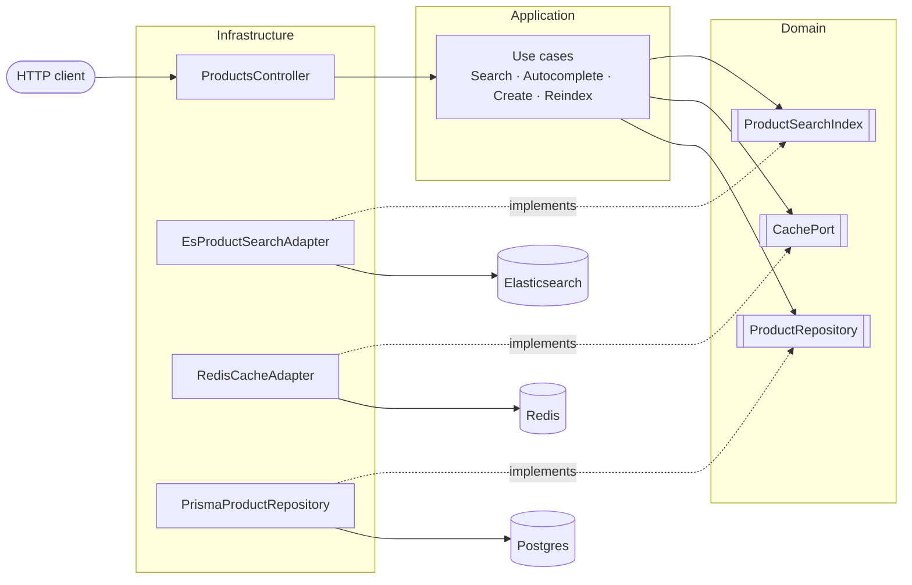

# Advanced Product Search API

A NestJS API for advanced product search built around Elasticsearch relevance, Redis backed autocomplete and a Postgres source of truth. The codebase follows a hexagonal architecture so the domain and application layers stay free of any framework or vendor detail.

## Table of contents

1. [Features](#features)
2. [Architecture](#architecture)
3. [Tech stack](#tech-stack)
4. [Quick start with Docker](#quick-start-with-docker)
5. [Local development](#local-development)
6. [Configuration](#configuration)
7. [API reference](#api-reference)
8. [Testing](#testing)
9. [Design notes](#design-notes)
10. [Known tradeoffs and next steps](#known-tradeoffs-and-next-steps)

## Features

* Full text search over name, description, category, subcategories, location and price.
* Relevance ranking. Name matches weigh highest, with a gentle popularity boost blended into the score.
* Geo search: filter by a radius around a coordinate and sort by distance, alongside the plain city filter.
* Autocomplete served from Elasticsearch and cached in Redis, with typo tolerance so `laptp` still completes to laptops.
* Query suggestions (did you mean) powered by a phrase suggester, collated against the index so every suggestion is guaranteed to return results.
* Combined and individual faceting for categories, subcategories, location and price.
* Filtering by category, subcategories, location, price range and geo radius.
* Highlighting of the matched terms in name and description.
* Pagination and sorting by relevance, popularity, creation date or distance.
* Typo tolerance through fuzzy matching, so labtop still finds laptops.
* Full product lifecycle: create, update, delete and a view event that feeds a live popularity signal.
* Zero downtime reindexing: rebuilds stream into a staging index and an atomic alias swap makes them visible.
* Transactional outbox: every write records an entry that a background processor replays, so the search projection converges even through an Elasticsearch outage.
* Structured JSON logging with request correlation ids, rate limiting, graceful shutdown and readiness aware health checks.
* Environment driven configuration validated at startup and global error handling with precise status codes.
* Unit tests plus an end to end suite that runs the real stack through Testcontainers, wired into CI.

## Architecture

The `products` module is split into three layers. Dependencies always point inward, toward the domain.


```mermaid
flowchart LR
  Client([HTTP client]) --> Controller

  subgraph Infrastructure
    Controller[ProductsController]
    ESAdapter[EsProductSearchAdapter]
    RedisAdapter[RedisCacheAdapter]
    PrismaRepo[PrismaProductRepository]
  end

  subgraph Application
    UC["Use cases<br/>Search · Autocomplete · Create · Reindex"]
  end

  subgraph Domain
    P1[[ProductSearchIndex]]
    P2[[CachePort]]
    P3[[ProductRepository]]
  end

  Controller --> UC
  UC --> P1
  UC --> P2
  UC --> P3

  ESAdapter -. implements .-> P1
  RedisAdapter -. implements .-> P2
  PrismaRepo -. implements .-> P3

  ESAdapter --> ES[(Elasticsearch)]
  RedisAdapter --> Redis[(Redis)]
  PrismaRepo --> PG[(Postgres)]
```

The use cases depend on the ports (the boxed interfaces). The adapters implement those ports, so the arrows of implementation point inward toward the domain: that is the dependency inversion that keeps the core independent of Elasticsearch, Redis and Prisma. The folder layout mirrors it:

```
src/products/
  domain/                      core, no framework or vendor imports
    product.ts                 Product aggregate
    ports/                     ProductRepository, ProductSearchIndex, CachePort (interfaces)
    search/                    SearchCriteria and SearchResult value objects
  application/
    use-cases/                 SearchProducts, Autocomplete, CreateProduct, ReindexProducts
  infrastructure/              adapters that implement the domain ports
    http/                      controllers, DTOs, mappers
    persistence/prisma/        Postgres repository via Prisma
    search/                    Elasticsearch adapter and query builder
    cache/                     Redis adapter
```

The domain defines ports (interfaces) and the infrastructure provides adapters. Use cases depend only on the ports, never on Prisma or the Elasticsearch client, which keeps the core testable in isolation and the technology choices replaceable.

Postgres is the write model and single source of truth. Elasticsearch is a denormalized read projection of it. When a product is created the write use case saves it to Postgres and then indexes it into Elasticsearch. A `search:reindex` command rebuilds the whole index from Postgres on demand.

### Path aliases

Imports use the `@/` alias mapped to `src/` (for example `@/products/domain/product`). It resolves in every context: the Nest build and jest handle it natively, and the production build rewrites the alias to relative paths with `tsc-alias` so the compiled output in `dist/` runs under plain Node with no runtime loader.

## Tech stack

| Concern            | Choice                          |
| ------------------ | ------------------------------- |
| Framework          | NestJS 10                       |
| Language           | TypeScript                      |
| Search engine      | Elasticsearch 8                 |
| Cache and suggest  | Redis 7                         |
| Source of truth    | PostgreSQL 16                   |
| ORM                | Prisma                          |
| Validation         | class validator, Joi for env    |
| API docs           | Swagger (OpenAPI)               |
| Logging            | pino via nestjs pino            |
| Rate limiting      | NestJS throttler                |
| Health checks      | NestJS terminus                 |
| Tests              | Jest, Supertest, Testcontainers |
| CI                 | GitHub Actions                  |

## Quick start with Docker

Requirements: Docker and Docker Compose.

```bash
docker compose up --build
```

That command brings up Postgres, Elasticsearch, Redis and the API. On startup the API container syncs the database schema, seeds sample products (skipped if the table is already populated) and reindexes Elasticsearch from Postgres before it starts listening. The reindex is idempotent: it runs only when the index is out of sync with Postgres, so restarting the container does not tear down a healthy index.

Once the stack is healthy:

* API base URL: `http://localhost:3000/api`
* Swagger docs: `http://localhost:3000/api/docs`
* Health check: `http://localhost:3000/api/health`

Try a request:

```bash
curl "http://localhost:3000/api/products/search?q=laptop&sort=relevance"
```

To change the amount of seed data set `SEED_PRODUCT_COUNT` in `docker-compose.yml` before bringing the stack up. It defaults to 500 products.

To stop and remove the stack together with its volumes:

```bash
docker compose down -v
```

### Upgrading an existing volume

A plain `docker compose up --build` migrates an already populated stack in place: `db push` adds the new nullable coordinate columns, the seed backfills coordinates for existing rows, and the boot reindex rebuilds the versioned index (`products_v2`) with the new mapping. `docker compose down -v` remains the clean slate path.

## Local development

You can run the API on the host while the infrastructure runs in Docker.

```bash
# 1. Start only the backing services
docker compose up -d postgres elasticsearch redis

# 2. Install dependencies and generate the Prisma client
npm install
npm run prisma:generate

# 3. Copy the environment file (the defaults already target localhost)
cp .env.example .env

# 4. Prepare the database and the index
npm run bootstrap        # db push, seed, reindex

# 5. Run the API in watch mode
npm run start:dev
```

Useful scripts:

| Script                    | Purpose                                         |
| ------------------------- | ----------------------------------------------- |
| `npm run start:dev`       | Run the API in watch mode                       |
| `npm run build`           | Compile to `dist/` (tsc plus tsc-alias)         |
| `npm run db:push`         | Sync the Prisma schema to Postgres              |
| `npm run db:seed`         | Seed sample products with faker                 |
| `npm run search:reindex`  | Force a full rebuild of the Elasticsearch index |
| `npm run bootstrap`       | Run db:push, db:seed and search:reindex in order|
| `npm test`                | Run the unit test suite                         |
| `npm run test:e2e`        | Run the end to end suite (needs Docker)         |
| `npm run test:cov`        | Run tests with coverage                         |
| `npm run lint`            | Lint and autofix                                |
| `npm run lint:check`      | Lint without fixing (used by CI)                |

## Configuration

Configuration comes from environment variables, validated at startup with Joi. The application refuses to boot on an invalid configuration.

| Variable                       | Default                          | Description                                  |
| ------------------------------ | -------------------------------- | -------------------------------------------- |
| `NODE_ENV`                     | `development`                    | Runtime environment                          |
| `PORT`                         | `3000`                           | HTTP port                                    |
| `API_PREFIX`                   | `api`                            | Global route prefix                          |
| `LOG_LEVEL`                    | `info`                           | pino log level                               |
| `THROTTLE_TTL_MS`              | `60000`                          | Rate limit window in milliseconds            |
| `THROTTLE_LIMIT`               | `120`                            | Requests allowed per window and client       |
| `THROTTLE_AUTOCOMPLETE_TTL_MS` | `10000`                          | Autocomplete rate limit window               |
| `THROTTLE_AUTOCOMPLETE_LIMIT`  | `30`                             | Autocomplete requests per window and client  |
| `OUTBOX_POLL_MS`               | `5000`                           | Interval of the outbox processor             |
| `DATABASE_URL`                 | see `.env.example`               | Postgres connection string                   |
| `ELASTICSEARCH_NODE`           | `http://localhost:9200`          | Elasticsearch endpoint                       |
| `ELASTICSEARCH_PRODUCT_INDEX`  | `products`                       | Index name                                   |
| `REDIS_HOST`                   | `localhost`                      | Redis host                                   |
| `REDIS_PORT`                   | `6379`                           | Redis port                                   |
| `REDIS_TTL_SECONDS`            | `60`                             | Default cache time to live                   |
| `SEARCH_MAX_PAGE_SIZE`         | `100`                            | Upper bound for the page size                |
| `AUTOCOMPLETE_MAX_SUGGESTIONS` | `10`                             | Upper bound for autocomplete results         |
| `SEED_PRODUCT_COUNT`           | `500`                            | Number of products created by the seed       |

## API reference

Base URL: `http://localhost:3000/api`. Interactive documentation lives at `/api/docs`.

### GET /products/search

Advanced search with relevance ranking, faceting, filtering, pagination, sorting and suggestions.

Query parameters:

| Parameter       | Type              | Description                                                        |
| --------------- | ----------------- | ----------------------------------------------------------------- |
| `q`             | string            | Free text query                                                   |
| `categories`    | string list       | Filter by category. Comma separated or repeated key               |
| `subcategories` | string list       | Filter by subcategory                                             |
| `locations`     | string list       | Filter by location                                                |
| `minPrice`      | number            | Lower price bound                                                 |
| `maxPrice`      | number            | Upper price bound                                                 |
| `lat`           | number            | Latitude of the search origin. Requires `lon`                     |
| `lon`           | number            | Longitude of the search origin. Requires `lat`                    |
| `radiusKm`      | number            | Only match products within this radius. Requires `lat` and `lon`  |
| `sort`          | enum              | `relevance`, `popularity`, `created_at` or `distance`. Defaults to relevance. `distance` requires `lat` and `lon` |
| `order`         | enum              | `asc` or `desc`. Defaults to desc, except `distance` which defaults to nearest first |
| `page`          | integer           | One based page number. Defaults to 1                              |
| `pageSize`      | integer           | Page size, capped by `SEARCH_MAX_PAGE_SIZE`. Defaults to 20       |

Geo example:

```bash
curl "http://localhost:3000/api/products/search?lat=40.4168&lon=-3.7038&radiusKm=25&sort=distance"
```

Example:

```bash
curl "http://localhost:3000/api/products/search?q=phone&categories=Electronics&minPrice=100&maxPrice=800&sort=popularity&order=desc&page=1&pageSize=10"
```

Response shape:

```json
{
  "data": [
    {
      "id": "…",
      "name": "Aurora Phone",
      "description": "…",
      "category": "Electronics",
      "subcategories": ["Smartphones"],
      "location": "Madrid",
      "coordinates": { "lat": 40.4321, "lon": -3.6852 },
      "price": 699.99,
      "popularity": 340,
      "createdAt": "2026-01-10T12:00:00.000Z",
      "score": 12.4,
      "highlights": { "name": "Aurora <em>Phone</em>" },
      "distanceKm": 3.21
    }
  ],
  "meta": { "total": 128, "page": 1, "pageSize": 10, "totalPages": 13 },
  "facets": {
    "categories": [{ "value": "Electronics", "count": 128 }],
    "subcategories": [{ "value": "Smartphones", "count": 64 }],
    "locations": [{ "value": "Madrid", "count": 30 }],
    "price": { "min": 100, "max": 799.99, "avg": 420.55 }
  },
  "suggestions": ["phones"]
}
```

`highlights` appears only for text queries when the engine produced fragments, and `distanceKm` only when sorting by distance.

Error semantics: a malformed request (inconsistent geo parameters, pagination beyond the first 10000 results, a query the engine rejects) returns `400` with a message explaining the problem. A search backend outage returns `503`. Client mistakes are never reported as outages.

### GET /products/autocomplete

Prefix suggestions for product names, served from Elasticsearch and cached in Redis. Exact prefixes rank first and a fuzzy clause rescues typos, so `laptp` still suggests laptops. This route has a stricter rate limit because it fires on every keystroke.

| Parameter | Type    | Description                                              |
| --------- | ------- | ------------------------------------------------------- |
| `q`       | string  | Prefix to complete                                      |
| `limit`   | integer | Maximum suggestions, capped by `AUTOCOMPLETE_MAX_SUGGESTIONS` |

```bash
curl "http://localhost:3000/api/products/autocomplete?q=lap&limit=5"
```

```json
{ "suggestions": ["Laptop", "Laptop stand", "Aurora Laptop Pro"] }
```

### POST /products

Creates a product in Postgres and projects it into Elasticsearch in the same use case, so it is immediately searchable. The write also bumps the cache generation, which instantly invalidates every cached search page. Coordinates are optional and must come as a pair.

```bash
curl -X POST "http://localhost:3000/api/products" \
  -H "Content-Type: application/json" \
  -d '{
    "name": "Aurora Laptop Pro",
    "description": "A lightweight laptop for everyday use",
    "category": "Electronics",
    "subcategories": ["Laptops"],
    "location": "Madrid",
    "latitude": 40.4168,
    "longitude": -3.7038,
    "price": 1299.99,
    "popularity": 120
  }'
```

### PUT /products/:id

Full replacement of a product. The identity and creation date are kept, and so is the accumulated popularity unless the body provides one. The change is searchable on the next request. Returns `404` for an unknown id.

### DELETE /products/:id

Removes the product from Postgres and from the search index. Returns `204` on success and `404` for an unknown id.

### POST /products/:id/view

Records a view: atomically increments the popularity in Postgres and reprojects the document, so relevance boosting and popularity sorting reflect real interactions. Returns the new popularity.

```bash
curl -X POST "http://localhost:3000/api/products/<id>/view"
```

```json
{ "id": "…", "popularity": 341 }
```

### GET /health

Readiness check. Pings Postgres, Elasticsearch and Redis through terminus and returns `503` with a per dependency breakdown when any of them is down, so an orchestrator stops routing traffic to a degraded instance.

### GET /health/liveness

Liveness check. Only proves the process responds, with no dependency checks, so a cache outage never causes a restart loop.

### Postman

A ready to use collection lives at `postman/advanced-search.postman_collection.json`. Import it into Postman. The `baseUrl` variable defaults to `http://localhost:3000/api`.

## Testing

**Unit tests** cover the pure logic where most of the behaviour lives: the Elasticsearch query builder (relevance shaping, combined faceting, geo clauses, filters, sorting, highlighting and suggestions), the HTTP to domain criteria mapper (including the geo consistency rules and the deep pagination guard), the caching behaviour of the use cases, the adapter error mapping, the Product aggregate invariants, the health indicators and the pagination helpers. They run fast and need no infrastructure.

```bash
npm test
npm run test:cov     # with coverage
```

**End to end tests** boot the real application (with the production middleware pipeline) against ephemeral Postgres, Elasticsearch and Redis containers managed by Testcontainers, and drive it over HTTP with Supertest. They verify relevance ordering, faceting, highlighting, typo tolerance, collated suggestions, geo radius filtering, distance sorting, cache invalidation on writes, validation errors, rate limiting and the readiness vs liveness split.

```bash
npm run test:e2e
```

They need a running Docker daemon (Docker Desktop on Windows and macOS). The first run downloads the service images, so allow a few extra minutes.

## Design notes

**Combined faceting.** Active filters are applied through `post_filter` so they narrow the hits without shrinking the top level aggregations. Each facet aggregation then reapplies every other active filter but not its own, so selecting one category still shows the sibling categories while the location and price facets already reflect that choice. This is the behaviour a faceted search UI expects.

**Relevance.** The text query is a `multi_match` with field boosts (name highest, then category and subcategories, then description) and `AUTO` fuzziness for typo tolerance. When sorting by relevance a `function_score` adds a gentle popularity factor on top of the text score rather than letting popularity dominate. When sorting by an explicit field that score shaping is skipped.

**Geo search.** Products carry an optional `geo_point`. A radius query becomes a `geo_distance` filter that also constrains every facet, and distance sorting uses `_geo_distance` with the per hit distance surfaced as `distanceKm`. Coordinates are nullable in Postgres so the schema upgrade works in place, and documents without coordinates simply sort last.

**Autocomplete typo tolerance.** The `search_as_you_type` query stays a `bool_prefix` `multi_match`, boosted so exact prefixes always win, with a separate fuzzy `match` clause as a rescue path. The clauses are separate because fuzziness inside a `bool_prefix` `multi_match` never applies to the final prefix term and behaves poorly on the shingle subfields.

**Suggestions that always work.** The phrase suggester runs with `confidence` 1.0, so a reasonable query is not corrected into noise, and a `collate` query checks every candidate against the index so a suggestion the user clicks always has results.

**Zero downtime reindexing.** Reads go through a stable alias while every rebuild streams into a fresh physical index named `{alias}_v{schema}_{timestamp}`. When the rebuild finishes, one atomic alias action makes the new generation visible and the old physicals are cleaned up; a failed rebuild is simply discarded, leaving the live index untouched. The schema version embedded in the physical name lets the boot reindex detect a mapping change and rebuild automatically, with no entrypoint changes and no manual steps.

**Transactional outbox.** Every product mutation writes an outbox entry in the same Postgres transaction. The request path still indexes synchronously (so writes are searchable on the next request), and a background processor replays pending entries against the index, which turns an Elasticsearch outage at write time into a short delay instead of silent drift. Replaying an already projected write is an idempotent upsert.

**Live popularity.** `POST /products/:id/view` atomically increments the popularity that the `function_score` blends into relevance and that `sort=popularity` ranks by. View events deliberately do not flush the search cache: a ranking nudge does not justify invalidating every cached page, and the short TTL bounds the staleness.

**Caching.** Search pages are cached in Redis under `search:v{schema}:g{generation}:{sha1(criteria)}`. Hashing keeps keys short and stable regardless of filter order, the schema version fences off stale shapes after a deploy, and the generation counter is bumped by every write, which instantly invalidates all cached pages without scanning Redis. Old entries simply expire through their TTL. Autocomplete uses the same scheme. Cached dates are rehydrated into real Date objects on read. Every cache operation degrades gracefully, so a Redis outage slows the API down instead of taking it down.

**Errors with the right status.** The Elasticsearch adapter distinguishes a rejected request (a 400 class response, surfaced as `InvalidSearchQueryError` and mapped to HTTP 400) from connectivity failures and server errors (`SearchUnavailableError`, HTTP 503). The deep pagination guard rejects requests beyond the `max_result_window` up front with a clear message.

**Observability and protection.** All logs are structured JSON through pino, each request carries a correlation id (honouring an inbound `x-request-id`), sensitive headers are redacted and health probes are excluded from access logs. A global throttler bounds request rates per client with a stricter budget for autocomplete, and shutdown hooks close Postgres and Redis connections cleanly on SIGTERM.

**Data model.** Postgres holds the write model and is the single source of truth. Elasticsearch is a read projection. Keeping the two responsibilities separate lets each side use the tool it is good at, and the reindex command can always rebuild the index from Postgres.

**Prisma 7.** Persistence uses Prisma 7 with the pg driver adapter. The client talks to Postgres through the `pg` driver instead of a bundled query engine, so there is no native engine binary to match against the container architecture. The connection URL lives in `prisma.config.ts` and is read from `DATABASE_URL`, shared by both the CLI (`db push`) and the application.

**Error handling.** A global exception filter turns any error into a consistent JSON envelope, and validation runs through a global pipe that rejects unknown fields.

## Known tradeoffs and next steps

These are deliberate choices for the scope of this challenge, called out so the boundaries are explicit rather than accidental.

* **Write path consistency.** Writes hit Postgres first (with a transactional outbox entry) and then index synchronously for immediate searchability, with the outbox processor as the convergence guarantee. The remaining tradeoff is the per request `refresh: wait_for`, which trades write latency for read your writes semantics; a high throughput system would drop it and accept eventual consistency.

* **Reindex scope.** The bootstrap reindex is idempotent (it rebuilds only when the index count differs from Postgres or the schema version changed), rebuilds are invisible thanks to the alias swap, and drift in document content between equal counts is the only case that still needs a manual `npm run search:reindex`. A write racing a reindex that runs in a different process can land only in the outgoing index generation; the outbox processor reprojects it into the new one within one poll interval.

* **Deep pagination.** Pagination uses `from` and `size` and the API rejects requests beyond the first 10000 results with a clear 400 instead of failing inside the engine. That is well beyond a realistic browse depth for this API, but a catalogue that needs to page arbitrarily deep would switch to `search_after`, which was deliberately left out.

* **Rate limit storage.** The throttler keeps its counters in memory, so limits are per instance. Running several replicas behind a balancer would need the Redis storage backend for shared budgets.

* **Popularity signal.** Views feed popularity live through the view endpoint. Richer signals (clicks, purchases, decay over time) and batched increments would be the next steps for a production ranking pipeline.

* **Single node infrastructure.** The Docker stack runs single node Elasticsearch with security disabled and no Redis or Postgres authentication hardening, which is appropriate for local evaluation but not for production.
